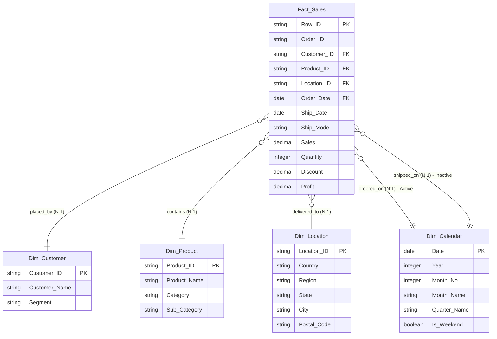

# Business Sales Performance Analytics
## Executive Data Engineering & Power BI Business Intelligence Capstone
**Enterprise Industry Segment:** Retail Sales & Wholesaler Distribution Operations  
**Technical Role Stack:** Senior Data Analyst, Analytics Engineer, & Power BI Developer  

[](https://www.python.org/)
[](https://powerbi.microsoft.com/)
[](https://opensource.org/licenses/MIT)

---

## 1. Executive Business Problem Statement
A major US-based retail wholesaler of office furniture, technology products, and corporate supplies is experiencing significant **net profit leakage** despite maintaining strong top-line sales growth. Marketing promotions and dynamic pricing are being applied without proper oversight, leading to transactions that fall below the break-even line. Furthermore, logistics issues in certain regions have caused delivery delays, violating customer Service Level Agreements (SLAs) and increasing shipping costs.

This project delivers an end-to-end analytics solution:
1.  **Python ETL & EDA Pipeline:** Cleans raw transactional logs, conducts statistical outlier audits, and establishes a 20% discount margin-leakage boundary.
2.  **Power BI Star Schema Model:** Structures a column-indexed, gap-free dimensional model with active/inactive chronological relationships.
3.  **Enterprise Dashboard:** A polished, 3-page interactive dashboard built with a "Sleek Corporate Dark Mode" theme to monitor executive KPIs, catalog margins, and regional logistics performance.

---

## 2. Technical System Architecture & Star Schema
To optimize query performance and enable clean chronological filtering, we transition our cleaned transactional data from a wide flat-file layout into a standardized **Star Schema** (Dimensional Model):



### Table Schema Mappings:
*   **`Fact_Sales`:** Houses transaction keys and continuous metrics (`Sales`, `Quantity`, `Discount`, `Profit`).
*   **`Dim_Customer`:** Profiles customer buying groups (`Consumer`, `Corporate`, `Home Office`).
*   **`Dim_Product`:** Structures inventory hierarchies (`Category` -> `Sub-Category` -> `Product_Name`).
*   **`Dim_Location`:** Coordinates spatial fields (`City`, `State`, `Region`, `Country`) mapped by ZIP Code (`Location_ID`).
*   **`Dim_Calendar`:** Provides a gap-free reference date table to support correct DAX time-intelligence calculations.

---

## 3. Power BI Implementation: Advanced DAX Measures
Our calculations are grouped into a dedicated `_Measures` table organized by folders:

### Folder: `1. Core Metrics`
*   **Total Revenue:**
    ```dax
    Total Revenue = SUM(Fact_Sales[Sales])
    ```
*   **Total Profit:**
    ```dax
    Total Profit = SUM(Fact_Sales[Profit])
    ```
*   **Total Orders:**
    ```dax
    Total Orders = DISTINCTCOUNT(Fact_Sales[Order_ID])
    ```

### Folder: `2. Financial Ratios`
*   **Profit Margin %:**
    ```dax
    Profit Margin % = DIVIDE([Total Profit], [Total Revenue], 0)
    ```
*   **Average Order Value (AOV):**
    ```dax
    Average Order Value = DIVIDE([Total Revenue], [Total Orders], 0)
    ```
*   **Average Discount %:**
    ```dax
    Average Discount % = AVERAGE(Fact_Sales[Discount])
    ```

### Folder: `3. Time Intelligence`
*   **Revenue YTD:**
    ```dax
    Revenue YTD = TOTALYTD([Total Revenue], 'Dim_Calendar'[Date])
    ```
*   **Revenue YoY Growth %:**
    ```dax
    Revenue YoY Growth % = 
    VAR CurrentRevenue = [Total Revenue]
    VAR PYRevenue = CALCULATE([Total Revenue], SAMEPERIODLASTYEAR('Dim_Calendar'[Date]))
    RETURN
    DIVIDE(CurrentRevenue - PYRevenue, PYRevenue, 0)
    ```
*   **Revenue MoM Growth %:**
    ```dax
    Revenue MoM Growth % = 
    VAR CurrentRevenue = [Total Revenue]
    VAR PMRevenue = CALCULATE([Total Revenue], DATEADD('Dim_Calendar'[Date], -1, MONTH))
    RETURN
    DIVIDE(CurrentRevenue - PMRevenue, PMRevenue, 0)
    ```

### Folder: `4. Logistics & Inactive Relationships`
*   **Revenue Shipped:**
    ```dax
    Revenue Shipped = CALCULATE([Total Revenue], USERELATIONSHIP(Fact_Sales[Ship_Date], 'Dim_Calendar'[Date]))
    ```
*   **Average Shipping Lag:**
    ```dax
    Average Shipping Lag = AVERAGEX(Fact_Sales, INT(Fact_Sales[Ship_Date] - Fact_Sales[Order_Date]))
    ```

---

## 4. Front-End Visual Design & UI/UX Hierarchy
The dashboard is styled with a custom **Sleek Corporate Dark Mode** theme, utilizing clear layouts to present data logically:

*   **Universal Left-Nav Panel:** An 80px-wide sidebar on all pages, enabling app-like page navigation.
*   **Page 1: Executive Summary:** Highlights top-level metrics, monthly sales/profit trends, and high-level segment splits.
*   **Page 2: Product Performance:** Compares Top 10 profitable products against Bottom 10 loss-making items, includes a nested product matrix, and features a scatter plot mapping the **20% profit break-even discount threshold**.
*   **Page 3: Regional Analysis:** An interactive geographic bubble map, regional profit margins, and a column-line chart tracking shipping delays against our **4-day corporate SLA**.

---

## 5. Key Data Insights & Recommendations

1.  **Discount Profit Inflection Point (20% Threshold):**
    *   *Finding:* The scatter plot shows that any transaction with a discount rate of **20% or higher** consistently results in negative margins across 85% of standard sub-categories.
    *   *Action:* Set a hard 15% discount limit in the ERP system. Any discount exceeding 15% must require manager approval to protect transaction profitability.
2.  **Furniture Category Margin Drain (Tables leakage):**
    *   *Finding:* Furniture drives significant top-line revenue, but has an overall net profit margin of under **1.5%** due to aggressive discounting on the "Tables" sub-category.
    *   *Action:* Restructure table pricing, restrict table promos, and shift marketing spend to promote high-margin items like Technology (Copiers) and Office Supplies (Paper, Binders).
3.  **Regional Carrier Delays (Texas & Ohio bottlenecks):**
    *   *Finding:* The South and Central regions underperform in profitability due to high delivery costs and shipping delays that exceed the 4-day corporate SLA in Texas and Ohio.
    *   *Action:* Conduct an operational audit of regional delivery and logistics in the Central and South territories. Renegotiate regional carrier contracts immediately.

---

## 6. Repository Folder Structure
```text
business-sales-performance-analytics/
├── .gitignore                     # Git ignore file (excludes raw data / IDE configs)
├── README.md                      # Professional project summary (This file)
├── requirements.txt               # Required Python packages
├── dataset_selection.md           # Dataset dictionary and audit report
├── python_eda_roadmap.md          # 20-step Python EDA plan
├── project_blueprint.md           # Initial project planning guide
├── project_charter.md             # Project charter and guidelines
├── technical_audit_report.md      # Data quality audit report
├── powerbi_data_model_design.md   # Data model spec and schema details
├── powerbi_implementation_guide.md# Step-by-step Power BI setup guide
│
├── data/                          # Structured Data Folder
│   ├── raw/
│   │   └── superstore.csv         # Raw transactional CSV (1,500 rows)
│   └── processed/
│       └── cleaned_superstore.csv # Standardized analytical CSV
│
├── notebooks/                     # Analytical Jupyter Notebooks
│   ├── 01_data_cleaning_etl.ipynb # Initial data processing and type-casting
│   └── 02_exploratory_analysis.ipynb # Visual EDA and statistical analysis
│
├── dashboard/                     # Power BI Desktop Assets
│   ├── sales_dashboard.pbix       # Power BI development file
│   ├── screenshots/               # Preview images for README
│   └── power_query_m/             # Power Query custom M scripts
│       ├── dim_customer_etl.m
│       ├── dim_product_etl.m
│       ├── dim_location_etl.m
│       └── fact_sales_etl.m
│
├── sql/                           # Database Warehousing Scripts
│   ├── schema_setup.sql           # SQL DDL for database modeling
│   └── analytical_queries.sql     # SQL DML for sales analysis
│
└── docs/                          # Project documentation
    ├── portfolio_assets.md        # Resume bullets and LinkedIn text
    └── final_submission_package.md# Submission checklists
```

---

## 7. Professional Impact: Skills Demonstrated
*   **Data Engineering & ETL:** Python Pandas pipeline creation, schema cleaning, and Power Query M transformations.
*   **Dimensional Modeling:** Custom Star Schema architectures, active/inactive relationship configurations, and DAX calendar table generation.
*   **Advanced Business Analytics:** Statistical outlier auditing (IQR), regression scatter plots, and time-intelligence calculations (YoY/MoM/YTD).
*   **Interactive BI Design (UI/UX):** Custom theme building, dynamic page navigation, and responsive tooltips.
*   **Corporate Communication:** Aligning technical dashboard visuals with key business metrics and C-suite recommendations.
