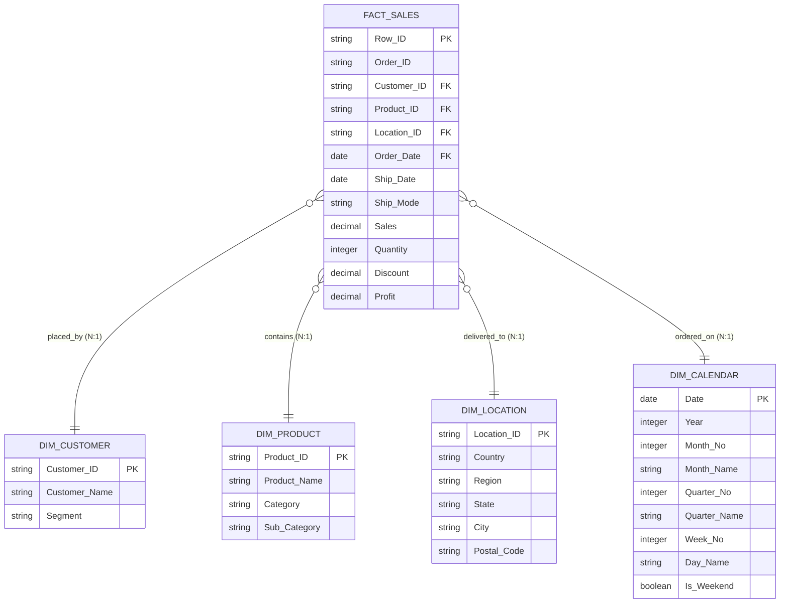

# Power BI Data Model Design Specification
## Project: Business Sales Performance Analytics
**Role:** Senior Power BI Solutions Architect  
**Project Phase:** Phase 3 (Data Modeling & Star Schema Architecture)  
**Status:** Approved for Implementation  

---

## 1. Architectural Strategy: The Star Schema
To ensure maximum query performance, clean visual filtering, and fast calculation of DAX time-intelligence formulas, we transition our cleaned sales transactional dataset (`cleaned_superstore.csv`) from a wide flat-file layout into a standardized **Star Schema (Dimensional Model)**.

In this architecture:
*   **Facts (Metrics):** Stored inside the central transactional table `Fact_Sales`.
*   **Dimensions (Context):** Separated into dedicated, normalized lookup tables (`Dim_Customer`, `Dim_Product`, `Dim_Location`, `Dim_Calendar`).



---

## 2. Table Structure Details

### A. Central Fact Table: `Fact_Sales`
Contains continuous numerical facts and foreign keys linking to dimension lookup tables.

| Column in flat file | Power BI Table Name | Logical Role | Formatting |
| :--- | :--- | :--- | :--- |
| `row_id` | `Fact_Sales[Row_ID]` | Primary Key (Hide in Report View) | Whole Number |
| `order_id` | `Fact_Sales[Order_ID]` | Degenerate Dimension | Text |
| `customer_id` | `Fact_Sales[Customer_ID]` | Foreign Key (Hide in Report View) | Text |
| `product_id` | `Fact_Sales[Product_ID]` | Foreign Key (Hide in Report View) | Text |
| `postal_code` | `Fact_Sales[Location_ID]` | Foreign Key (Hide in Report View) | Text (Geographic Zip) |
| `order_date` | `Fact_Sales[Order_Date]` | Foreign Key (Hide in Report View) | Date (`YYYY-MM-DD`) |
| `ship_date` | `Fact_Sales[Ship_Date]` | Transaction Date | Date (`YYYY-MM-DD`) |
| `ship_mode` | `Fact_Sales[Ship_Mode]` | Transaction Attribute | Text |
| `sales` | `Fact_Sales[Sales]` | Fact (Add to standard measures) | Currency (`$#,##0.00`) |
| `quantity` | `Fact_Sales[Quantity]` | Fact (Add to standard measures) | Whole Number |
| `discount` | `Fact_Sales[Discount]` | Fact (Add to standard measures) | Percentage (`0.0%`) |
| `profit` | `Fact_Sales[Profit]` | Fact (Add to standard measures) | Currency (`$#,##0.00`) |

---

### B. Lookup Dimension Tables (Built via Power Query or DAX)

#### 1. Customer Directory: `Dim_Customer`
*   *Source derivation:* `REMOVE DUPLICATES` on `customer_id`, `customer_name`, and `segment` from the flat file.
*   *Key Columns:* `Customer_ID` (Unique Key), `Customer_Name`, `Segment`.

#### 2. Product Catalog: `Dim_Product`
*   *Source derivation:* `REMOVE DUPLICATES` on `product_id`, `product_name`, `category`, and `sub_category` from the flat file.
*   *Key Columns:* `Product_ID` (Unique Key), `Product_Name`, `Category`, `Sub-Category`.

#### 3. Geographic Territory: `Dim_Location`
*   *Source derivation:* `REMOVE DUPLICATES` on `postal_code` (linked to `city`, `state`, `region`, `country`).
*   *Key Columns:* `Location_ID` (Postal Code, Unique Key), `City`, `State`, `Region`, `Country`.
*   *Power BI Map Tagging:* Explicitly set the Data Category for City to `City`, State to `State or Province`, and Postal Code to `Postal Code` to ensure accurate map rendering.

---

## 3. Production Calendar Table: `Dim_Calendar` (DAX Script)
Never rely on Power BI's automatic date hierarchy; it creates hidden tables that slow down performance. Instead, click **"New Table"** in Power BI and paste this comprehensive, gap-free DAX script:

```dax
Dim_Calendar = 
VAR MinDate = MIN(Fact_Sales[Order_Date])
VAR MaxDate = MAX(Fact_Sales[Order_Date])
RETURN
ADDCOLUMNS(
    CALENDAR(MinDate, MaxDate),
    "Year", YEAR([Date]),
    "Year_Name", "CY " & YEAR([Date]),
    "Month_No", MONTH([Date]),
    "Month_Name", FORMAT([Date], "MMMM"),
    "Month_Short", FORMAT([Date], "MMM"),
    "Quarter_No", QUARTER([Date]),
    "Quarter_Name", "Q" & FORMAT([Date], "Q"),
    "Quarter_Year", "Q" & FORMAT([Date], "Q") & "-" & YEAR([Date]),
    "Week_No", WEEKNUM([Date]),
    "Day_No", DAY([Date]),
    "Day_Name", FORMAT([Date], "dddd"),
    "Day_Short", FORMAT([Date], "ddd"),
    "Day_Of_Week", WEEKDAY([Date]),
    "Is_Weekend", IF(WEEKDAY([Date]) IN {1, 7}, 1, 0)
)
```

> [!IMPORTANT]
> **Sort-By Columns Best Practice:** In Power BI's Data View, click on `Month_Name` (or `Month_Short`) and select **"Sort by Column" -> `Month_No`**. Do the same for `Quarter_Name` sorted by `Quarter_No`. This prevents alphabetical sorting (e.g., April showing up before January) in your visual charts.

---

## 4. Relationship Configurations & Cardinality
Configure your model relationships exactly as detailed below to protect calculation logic:

1.  **`Dim_Customer` to `Fact_Sales`**
    *   *Relationship:* `1:Many` (One Customer to Many Transactions).
    *   *Cardinality:* `1` on `Dim_Customer[Customer_ID]` to `*` on `Fact_Sales[Customer_ID]`.
    *   *Cross-Filter Direction:* **Single** (Dimensions filter the Fact Table, never vice versa).
2.  **`Dim_Product` to `Fact_Sales`**
    *   *Relationship:* `1:Many` (One Product to Many Transactions).
    *   *Cardinality:* `1` on `Dim_Product[Product_ID]` to `*` on `Fact_Sales[Product_ID]`.
    *   *Cross-Filter Direction:* **Single**.
3.  **`Dim_Location` to `Fact_Sales`**
    *   *Relationship:* `1:Many` (One Location ZIP to Many Transactions).
    *   *Cardinality:* `1` on `Dim_Location[Location_ID]` to `*` on `Fact_Sales[Location_ID]`.
    *   *Cross-Filter Direction:* **Single**.
4.  **`Dim_Calendar` to `Fact_Sales`**
    *   *Relationship:* `1:Many` (One Date to Many Transactions).
    *   *Cardinality:* `1` on `Dim_Calendar[Date]` to `*` on `Fact_Sales[Order_Date]`.
    *   *Cross-Filter Direction:* **Single** (Active Relationship).

---

## 5. Required DAX Measures (Divided by folders)
Store these measures in a dedicated table named `_Measures` to keep the model clean.

### Folder: 1. Core Metrics
```dax
Total Revenue = SUM(Fact_Sales[Sales])
-- Format: Currency ($#,##0.00)
```
```dax
Total Cost = SUMX(Fact_Sales, Fact_Sales[Sales] - Fact_Sales[Profit])
-- Format: Currency ($#,##0.00)
```
```dax
Total Profit = SUM(Fact_Sales[Profit])
-- Format: Currency ($#,##0.00)
```
```dax
Total Quantity = SUM(Fact_Sales[Quantity])
-- Format: Whole Number (#,##0)
```
```dax
Total Orders = DISTINCTCOUNT(Fact_Sales[Order_ID])
-- Format: Whole Number (#,##0)
```

### Folder: 2. Financial Margins & AOVs
```dax
Profit Margin % = DIVIDE([Total Profit], [Total Revenue], 0)
-- Format: Percentage (0.00%)
```
```dax
Average Order Value = DIVIDE([Total Revenue], [Total Orders], 0)
-- Format: Currency ($#,##0.00)
```
```dax
Average Discount % = AVERAGE(Fact_Sales[Discount])
-- Format: Percentage (0.0%)
```

### Folder: 3. Time Intelligence (Period Comparisons)
```dax
Revenue YTD = TOTALYTD([Total Revenue], 'Dim_Calendar'[Date])
-- Format: Currency ($#,##0.00)
```
```dax
Prior Year Revenue = CALCULATE([Total Revenue], SAMEPERIODLASTYEAR('Dim_Calendar'[Date]))
-- Format: Currency ($#,##0.00)
```
```dax
Revenue YoY Growth % = 
VAR CurrentRevenue = [Total Revenue]
VAR PYRevenue = [Prior Year Revenue]
RETURN
DIVIDE(CurrentRevenue - PYRevenue, PYRevenue, 0)
-- Format: Percentage (0.00%)
```
```dax
Prior Month Revenue = CALCULATE([Total Revenue], DATEADD('Dim_Calendar'[Date], -1, MONTH))
-- Format: Currency ($#,##0.00)
```
```dax
Revenue MoM Growth % = 
VAR CurrentRevenue = [Total Revenue]
VAR PMRevenue = [Prior Month Revenue]
RETURN
DIVIDE(CurrentRevenue - PMRevenue, PMRevenue, 0)
-- Format: Percentage (0.00%)
```

---

## 6. Slicers, Filters, & KPI Cards

### Executive KPI Cards (Top Page Banner)
*   **Card 1:** Net Sales Volume. Displays `[Total Revenue]`.
*   **Card 2:** Profitability. Displays `[Total Profit]`.
*   **Card 3:** Margin. Displays `[Profit Margin %]`. (Apply conditional formatting: Red if < 10%, Green if >= 10%).
*   **Card 4:** Average Deal Size. Displays `[Average Order Value]`.

### Global Dashboard Slicers (Target Visual Filters)
*   **Slicer 1 (Calendar):** Year Slicer (`Dim_Calendar[Year]`) configured as a single-select dropdown.
*   **Slicer 2 (Geography):** Regional Director Selection (`Dim_Location[Region]`) configured as horizontal tile buttons.
*   **Slicer 3 (Customer):** Market segment filter (`Dim_Customer[Segment]`) configured as a checkbox dropdown.

---

## 7. Model Performance Optimization Guidelines
Adopt these production standards to keep your model fast and scalable:

1.  **Hide Key Fields (Star Schema Cleanliness):**
    *   Always hide all ID columns and raw fact values inside `Fact_Sales` (e.g. hide Customer_ID, Product_ID, Sales, Profit). 
    *   Forces users to build visuals using lookup columns (from Dimensions) and explicit DAX measures, preventing accidental calculation errors.
2.  **Avoid Bi-directional Cross-Filtering:**
    *   Keep cross-filter direction as **Single**. Bi-directional filters create circular paths and slow down performance.
3.  **Strict Data Types:**
    *   Set text formatting only on actual descriptor fields. Keep all keys and ID fields as clean, compressed strings.
4.  **Use Variables (`VAR`) in DAX:**
    *   Utilize `VAR / RETURN` patterns inside your DAX expressions. Variables are computed only once per query, preventing Power BI from repeating expensive calculation passes.
