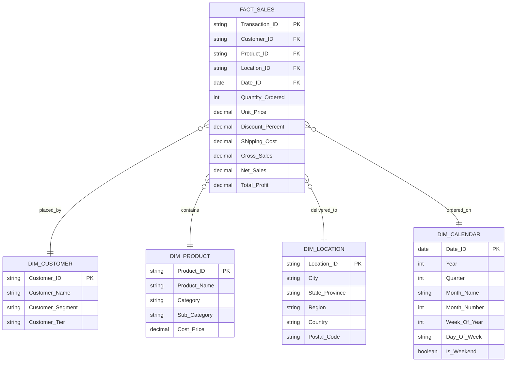

# Project Charter & Execution Framework
## Business Sales Performance Analytics
**Client:** Executive Leadership & Sales Operations  
**Prepared by:** Senior Data Analytics Consultant  
**Date:** May 31, 2026  
**Status:** Phase 1: Initiation & Requirements Definition

---

## 1. Executive Summary & Project Context
In today's hyper-competitive market, data-driven decision-making is the cornerstone of sustainable growth. The Sales Operations and Executive leadership teams require actionable, deep-dive insights into historical transactional data. This project, **Business Sales Performance Analytics**, aims to bridge the gap between raw transaction logs and executive-level strategic decisions. 

By designing and executing a structured analytics pipeline, we will identify critical revenue drivers, optimize product portfolios, evaluate regional market penetration, and build a unified dashboard that serves as a single source of truth for key business metrics.

---

## 2. Business Objectives (The Strategic "Why")
To deliver maximum value to the business, the project is structured around five strategic pillars:

```
┌────────────────────────────────────────────────────────────────────────┐
│                        STRATEGIC BUSINESS PILLARS                      │
├───────────────────┬───────────────────┬──────────────────┬─────────────┤
│  Revenue Growth   │ Product Portfolio │ Regional Market  │ Operational │
│    & Trends       │   Optimization    │  Penetration     │ Efficiency  │
└───────────────────┴───────────────────┴──────────────────┴─────────────┘
```

1. **Revenue Growth & Trend Analysis:**
   - Detect seasonal sales cycles, peak purchasing periods, and baseline growth rates.
   - Forecast future revenue paths using historical trends to support inventory planning and financial budgeting.
2. **Product & Category Portfolio Optimization:**
   - Segment products into performance tiers to identify high-volume drivers, high-margin stars, and slow-moving inventory.
   - Analyze category relationships to optimize cross-selling strategies and shelf/catalog placement.
3. **Regional Market Penetration:**
   - Map sales distribution geographically to identify high-performing territories and underserved regions.
   - Surface regional differences in customer buying behavior, category preferences, and pricing sensitivity.
4. **Customer Lifetime & Value Insights:**
   - Evaluate customer segments (e.g., Corporate, Consumer, Home Office) to understand who is driving value and where marketing spend should be focused.
   - Analyze Average Order Value (AOV) and purchase frequency dynamics.
5. **Executive KPI Standardization:**
   - Define and align organization-wide formulas for key metrics, ensuring data consistency across all management reports.

---

## 3. Ideal Dataset Structure
To ensure scalability, performance, and flexibility, we design our analytical data model using a standard **Star Schema** (Dimensional Modeling). This separates transactional metrics (Facts) from descriptive context (Dimensions).



> [!NOTE]
> If using a flat spreadsheet or a single CSV file for initial analytics (common in initial internship phases), all dimensions are merged into a single wide table. However, keeping the logical separation during analysis (e.g., using GROUP BY on categories/regions) is critical.

---

## 4. Data Dictionary (Required Schema)
The following fields represent the minimum data requirements to support our analytical objectives.

| Column Name | Business Description | Recommended Data Type | Primary/Foreign Key | Data Validation & Constraints |
| :--- | :--- | :--- | :--- | :--- |
| `transaction_id` | Unique identifier for each sales transaction line. | `VARCHAR(50)` / `INT` | **Primary Key** | Cannot be Null; must be unique. |
| `order_date` | Date when the order was placed by the customer. | `DATE` / `DATETIME` | Foreign Key (Calendar) | Format: `YYYY-MM-DD`. Cannot be in the future. |
| `customer_id` | Unique identifier for the customer. | `VARCHAR(50)` | Foreign Key (Customer) | Cannot be Null. |
| `customer_name` | Full name of the customer or business entity. | `VARCHAR(100)` | Dimension Attribute | Standard text string. |
| `segment` | Classification of customer market. | `VARCHAR(50)` | Dimension Attribute | e.g., 'Consumer', 'Corporate', 'Home Office'. |
| `product_id` | Unique SKU identifier for the product sold. | `VARCHAR(50)` | Foreign Key (Product) | Cannot be Null. |
| `product_name` | Commercial name of the product. | `VARCHAR(255)` | Dimension Attribute | Standard text string. |
| `category` | Broad product classification. | `VARCHAR(100)` | Dimension Attribute | e.g., 'Technology', 'Furniture', 'Office Supplies'. |
| `sub_category` | Specific sub-division of the product category. | `VARCHAR(100)` | Dimension Attribute | e.g., 'Phones', 'Chairs', 'Paper'. |
| `quantity` | Number of units purchased in the transaction. | `INTEGER` | Fact Metric | Must be greater than 0 (`> 0`). |
| `unit_price` | Standard list price per unit before discounts. | `DECIMAL(10, 2)` | Fact Metric | Must be greater than or equal to 0 (`>= 0.00`). |
| `discount` | Percent discount applied (e.g., 0.15 for 15%). | `DECIMAL(4, 2)` | Fact Metric | Must be between `0.00` and `1.00`. Default is `0.00`. |
| `shipping_cost` | Freight/delivery cost associated with order line. | `DECIMAL(10, 2)` | Fact Metric | Default `0.00`. Must be `>= 0.00`. |
| `sales` | Net revenue generated (Calculated field if not raw). | `DECIMAL(12, 2)` | Fact Metric | Formula: `(quantity * unit_price) * (1 - discount)`. |
| `profit` | Net profit generated (Calculated field if not raw). | `DECIMAL(12, 2)` | Fact Metric | Formula: `sales - (quantity * unit_cost) - shipping_cost`. |
| `city` | Shipping city destination. | `VARCHAR(100)` | Dimension Attribute | Standard spelling, clean casing. |
| `region` | Geographical sales territory. | `VARCHAR(50)` | Dimension Attribute | e.g., 'North', 'East', 'South', 'West', 'Central'. |
| `country` | Shipping country destination. | `VARCHAR(100)` | Dimension Attribute | Standardized country codes or names. |

---

## 5. Key Performance Indicators (KPIs)
To monitor performance and report to executive stakeholders, we will track and visualize the following standardized KPIs:

### 1. Financial KPIs
*   **Total Revenue (Gross Sales):** Total sales volume before any deductions.
    $$\text{Total Revenue} = \sum (\text{Quantity} \times \text{Unit Price})$$
*   **Net Revenue:** Realized income after discounts.
    $$\text{Net Revenue} = \sum (\text{Quantity} \times \text{Unit Price} \times (1 - \text{Discount}))$$
*   **Total Profit:** Bottom-line contribution.
    $$\text{Total Profit} = \sum (\text{Net Sales} - \text{Total Cost} - \text{Shipping Cost})$$
*   **Gross Profit Margin (%):** Ratio of profit to revenue, indicating pricing power and cost control.
    $$\text{Gross Profit Margin (\%)} = \left( \frac{\text{Total Profit}}{\text{Net Revenue}} \right) \times 100$$

### 2. Operational & Transactional KPIs
*   **Average Order Value (AOV):** Average amount spent per transaction.
    $$\text{AOV} = \frac{\text{Net Revenue}}{\text{Distinct Transactions}}$$
*   **Total Units Sold:** Absolute volume of products moved.
    $$\text{Total Units} = \sum (\text{Quantity})$$
*   **Average Discount Rate:** Monitor margin erosion caused by promotional activity.
    $$\text{Average Discount} = \text{Average}(\text{Discount})$$

### 3. Growth & Performance KPIs
*   **Month-over-Month (MoM) / Year-over-Year (YoY) Sales Growth:** Velocity of revenue expansion.
    $$\text{Sales Growth (\%)} = \left( \frac{\text{Net Sales}_{\text{Current Period}} - \text{Net Sales}_{\text{Prior Period}}}{\text{Net Sales}_{\text{Prior Period}}} \right) \times 100$$
*   **High-Value Product Ratio:** Proportion of revenue generated by top 20% of SKUs (Pareto principle analysis).

---

## 6. End-to-End Project Workflow
This workflow is modeled after top-tier consulting delivery methodologies, moving systematically from raw database tables to an interactive, executive-facing dashboard.

```mermaid
flowchart TD
    subgraph PHASE_1 ["1. Setup & Ingestion"]
        A["Git Repo & Folder Init"] --> B["Environment Setup (Python/SQL)"]
        B --> C["Raw Data Cataloging & Load"]
    end

    subgraph PHASE_2 ["2. Data Cleaning & Validation (ETL)"]
        C --> D["Handle Missing Values & Nulls"]
        D --> E["Standardize Formats (Dates, Casing)"]
        E --> F["Deduplication & Outlier Audit"]
    end

    subgraph PHASE_3 ["3. Exploratory Analysis (EDA)"]
        F --> G["Descriptive Stats & Margins"]
        G --> H["Time-Series Sales Aggregations"]
        H --> I["Category & Geographic Profiling"]
    end

    subgraph PHASE_4 ["4. Data Modeling & SQL Views"]
        I --> J["Create Star Schema Relations"]
        J --> K["Build Analytical Views & KPIs"]
    end

    subgraph PHASE_5 ["5. Interactive Dashboard Design"]
        K --> L["Wireframing & Layout Structure"]
        L --> M["Build Dynamic Charts & Filters"]
        M --> N["Aesthetic & UI Optimization"]
    end

    subgraph PHASE_6 ["6. Review & Presentation"]
        N --> O["KPI Verification & Peer Review"]
        O --> P["GitHub Documentation & Client Deck"]
    end

    style PHASE_1 fill:#f5f7fb,stroke:#6c757d,stroke-width:1px
    style PHASE_2 fill:#fdf8e2,stroke:#f8c045,stroke-width:1px
    style PHASE_3 fill:#eafaf1,stroke:#2ecc71,stroke-width:1px
    style PHASE_4 fill:#ebf5fb,stroke:#2980b9,stroke-width:1px
    style PHASE_5 fill:#f4ecf7,stroke:#8e44ad,stroke-width:1px
    style PHASE_6 fill:#fcf3cf,stroke:#f39c12,stroke-width:1px
```



---

## 7. Recommended Repository Folder Structure (GitHub Ready)
A clean, modular repository structure demonstrates high-caliber professionalism, making it extremely easy for hiring managers, technical interviewers, or clients to navigate your work.

```text
business-sales-performance-analytics/
├── .gitignore                     # Prevents tracking large datasets, virtual envs, and config files
├── README.md                      # Executive summary, methodology, KPIs, and dashboard screenshots
├── requirements.txt               # Python package dependencies (pandas, numpy, matplotlib, seaborn, openpyxl)
│
├── data/                          # Organized data storage (never track raw datasets directly to main)
│   ├── raw/                       # ORIGINAL untouched raw sales data (CSV/Excel)
│   └── processed/                 # CLEANED and validated data files ready for dashboard loading
│
├── notebooks/                     # Step-by-step interactive Jupyter Notebooks for analysis
│   ├── 01_data_cleaning_etl.ipynb # Initial ingest, data type conversions, null handling, deduplication
│   ├── 02_exploratory_analysis.ipynb# Descriptive stats, correlation, seasonality, product profiling
│   └── 03_deep_dive_insights.ipynb # Advanced customer segmentation, cohort analysis, regional drills
│
├── sql/                           # Structured Query Language (SQL) files for data warehouse modeling
│   ├── schema_setup.sql           # CREATE TABLE statements for dimensions, facts, and indexes
│   ├── data_cleaning.sql          # SQL scripts for validation and transformations
│   └── analytical_queries.sql     # Executive KPI queries, group-bys, and growth calculations
│
├── dashboard/                     # Visualization assets and templates
│   ├── sales_dashboard.pbix       # Power BI source file (or .twbx for Tableau)
│   ├── dashboard_mockup.png       # Visual wireframe or layout mockup of the final dashboard
│   └── screenshots/               # High-resolution screenshots of active tabs (e.g., Overview, Products, Geography)
│
├── src/                           # Reusable Python script modules (for production engineering)
│   ├── __init__.py
│   ├── utils.py                   # Custom helper functions for styling, loading, or plotting
│   └── database_connector.py      # Module to connect Python notebooks to SQLite/PostgreSQL
│
└── docs/                          # Presentation decks and reports
    ├── project_charter.md         # This business charter document
    └── sales_performance_deck.pdf # Final client-facing PowerPoint presentation (PDF format)
```

---

> [!TIP]
> **Best Practice for GitHub Submissions:** Always provide a clear, visual `README.md` that displays key charts and dynamic screenshots of your dashboard. Recruitment leads and managers spend less than 2 minutes scanning repositories; a striking visual at the very top immediately captures attention and sets you apart from other candidates.
